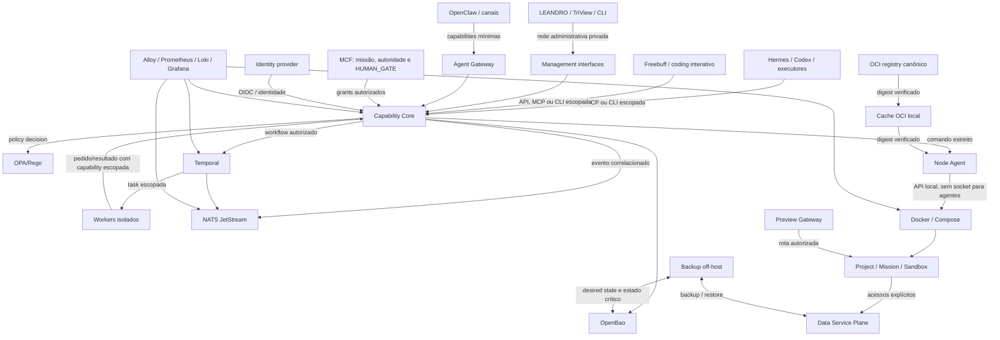

# 42 — TARGET_ARCHITECTURE

Status: **TARGET V1 — IMPLEMENTAÇÃO INCREMENTAL**
Escopo: DEV/lab/staging privado, single-node first
Produção: **FORA DO ESCOPO SEM HUMAN_GATE**

## Visão lógica

As setas representam interfaces autorizadas, não conectividade ampla. Todo acesso
é negado quando identidade, escopo, policy ou correlação não estão presentes.

## Fontes de verdade

| Domínio | Fonte de verdade | Não é fonte de verdade |
|---|---|---|
| Missão, autorização e gates | MCF + decisão humana persistida | Workflow Engine |
| Capability/policy/grants | Capability Core + policies versionadas | Executor/agente |
| Execução durável | Temporal | MCF |
| Eventos | NATS JetStream + consumidores duráveis | Logs best-effort |
| Desired state | GitHub `cloud-infrastructure` | alterações manuais no host |
| Identidade | IdP + identidade workload futura | nome de container/IP |
| Secrets | OpenBao | Git, `.env`, manifest ou log |
| Artefato executável | OCI registry por digest + provenance | tag mutável |
| Estado de aplicação | Data Service Plane/volumes declarados | writable layer do container |
| Evidência operacional | registros de auditoria versionados + observabilidade; storage ainda `CONDITIONAL` | mensagem de sucesso isolada |

## Planos e trust zones

### Management Plane

- acessível somente por rede administrativa privada;
- identidade de usuário/dispositivo e autenticação individual;
- Admin APIs/UI de IdP, cofre, workflow, observabilidade, registry cache e Core;
- SSH público permanece fallback transitório; VNC/Rescue são break-glass;
- nenhum agente, sandbox ou canal recebe rota para esta zona.

### Agent Gateway

- futuro endpoint público mínimo, separado do Management e Preview Gateways;
- aceita apenas capabilities publicáveis, identidade verificável, rate limit,
  nonce/replay protection e correlação;
- nunca expõe Docker, workflow admin, banco, cofre, OPA ou SSH;
- inexistente até threat model, identidade e Core estarem validados.

### Preview Gateway

- Caddy sem acesso ao socket Docker;
- configuração gerada/reconciliada pelo Capability Core;
- rotas DEV temporárias, allowlist e TLS;
- nenhum hostname/rota de produção pode ser criado por manifest DEV.

### Control Plane

- Capability Core em Go, OPA/Rego, IdP, OpenBao, Temporal e NATS;
- todos os listeners em loopback, Management Network ou redes internas dedicadas;
- serviços executam com identidades técnicas próprias e filesystem mínimo;
- comunicação intercomponente autenticada; IP/nome não concede autoridade.

### Execution Plane

- Node Agent é a única fronteira autorizada para operações privilegiadas de
  runtime e expõe uma API local estreita;
- Capability Core não entrega o Docker socket a executores;
- workers parcialmente confiáveis retornam ao Capability Core e nunca recebem o
  socket/API do Node Agent; a fronteira local revalida uma capability assinada,
  curta, audience-bound e allowlisted antes de qualquer verbo privilegiado;
- sandboxes usam usuário não-root, rootfs read-only quando possível,
  `no-new-privileges`, seccomp/AppArmor, caps removidas, limites cgroup e tmpfs;
- código adversarial forte poderá exigir gVisor ou execution node dedicado após
  teste; Docker/runc endurecido não é apresentado como VM de segurança.

### Data Plane

- PostgreSQL compartilhado fisicamente com database/owner/runtime role separados;
- Valkey apenas para cache/coordenação descartável;
- object storage S3-compatible somente após teste de compatibilidade/licença;
- mensageria de aplicação deve usar accounts/subjects/quotas separados dos eventos
  internos; reutilizar NATS é `CONDITIONAL` a teste que prove essa separação;
- databases/buckets/volumes de sandbox são descartáveis;
- recursos compartilhados só podem ser alcançados por grants explícitos.

## Modelo físico V1

`node-01` executa control, execution e data planes no mesmo Ubuntu/KVM. Isso é
single-node e possui um único failure domain; "durável" significa estado/retry
persistente, não alta disponibilidade.

O modelo de node é explícito para permitir depois:

- mover runners/builders e sandboxes não confiáveis para execution nodes;
- formar Temporal/NATS/PostgreSQL/OpenBao com múltiplos failure domains;
- transferir o control plane para outro provedor sem mudar o contrato do Core;
- reconstruir `node-01` a partir de desired state e backups.

## Envelope inicial de capacidade

| Reserva | Valor inicial | Regra |
|---|---:|---|
| Host + recovery + Workstation | piso provisório 7 GiB | revalidar por p95; o baseline observado de 6,2 GiB já excede a reserva antiga de 5 GiB |
| Control/Data Plane | alvo 6 GiB, high-water 8 GiB | instalar e medir por slice |
| Workload pool | teto dinâmico, inicialmente ≤7 GiB / 6000 millicores | reduzir quando host/control crescerem; admission control obrigatório |
| Folga não comprometida | ≥2 GiB | absorver migrations/restore/picos |
| Sandbox default | 1 vCPU, 1 GiB, 256 PIDs | máximo inicial de 2 concorrentes |
| Disco | negar admission abaixo de 20% livre | sem quota rígida de ext4 ainda |

O teto de workload é calculado como RAM total menos uso/reserva medidos do host,
control/data e folga; o high-water do control plane reduz o teto, não consome a
folga. As slices F1.1 apenas habilitam accounting e pesos. Limites duros só serão
aplicados depois de medição, para não provocar OOM ou quebrar a Workstation.

O ext4/overlay2 atual não oferece sozinho a quota rígida do writable layer exigida
por Q8/Q25. Até um spike selecionar e provar project quota/XFS, volume/bloco
limitado ou execution node compatível, sandboxes com escrita permanecem `PARTIAL`
e não podem satisfazer o critério de isolamento de disco por monitoramento apenas.

## Rede alvo

| Zona | Ingress permitido | Egress permitido |
|---|---|---|
| Management | dispositivos/usuários autorizados | serviços administrativos |
| Core | Management, gateways e workers autenticados | Data/Workflow/Event/Node APIs explícitas |
| Shared Data | apenas identidades/grants de serviços | backup/telemetria definidos |
| Project | Core/Preview quando autorizado | internet útil + shared services autorizados |
| Sandbox | nenhum por padrão | perfil `none`, `restricted` ou `development-default` |
| Public Agent | Internet no endpoint mínimo futuro | somente Capability Core |
| Public Preview | Internet no hostname DEV autorizado | somente workload alvo |

Docker DNS serve descoberta dentro da rede, mas identidade e autorização não
podem depender somente do nome/IP. O ruleset deve negar Management, metadata,
host e movimento lateral antes de liberar destinos úteis.

O mecanismo concreto para nftables/`DOCKER-USER`, DNS/egress por perfil, IPv6,
service discovery e auditoria permanece `CONDITIONAL` ao ADR de rede anterior ao
primeiro workload. Instalar Docker sem workload/porta não prova Q20/Q34.

## Portas e exposição

- estado atual preservado: público somente SSH 22;
- F1.1 não cria listener;
- Docker F1.2 começa sem `ports:`;
- portas administrativas nunca usam `0.0.0.0`/`::`;
- previews públicos exigem slice próprio de DNS/TLS/gateway;
- Agent Gateway público exige threat model e testes negativos próprios;
- toda exposição é verificada a partir de fora em IPv4 e IPv6.

## Evolução sem reabrir Q1–Q39

Implementações podem ser substituídas atrás dos contratos: IdP, cofre, workflow,
backbone, object store, observabilidade, registry e model gateway. A substituição
deve preservar identidade, escopo, auditoria, backup, portabilidade e rollback; a
troca de ferramenta não autoriza reduzir o requisito arquitetônico.

## Decisões condicionais que impedem `DONE`

- enforcement de rede/egress/service discovery e quota de disco;
- storage/retention do audit ledger;
- runner/build isolation sem socket privilegiado e tecnologia do cache OCI local;
- object storage e mensageria de aplicação segregada;
- implementação final do Model Gateway;
- namespace/provedor DNS e credencial escopada;
- RPO/RTO/retention e destino off-host por classe.

Esses itens não reabrem Q1–Q39: apenas registram que a tecnologia ou evidência
concreta ainda falta e deve permanecer `CONDITIONAL`/`PARTIAL`.
